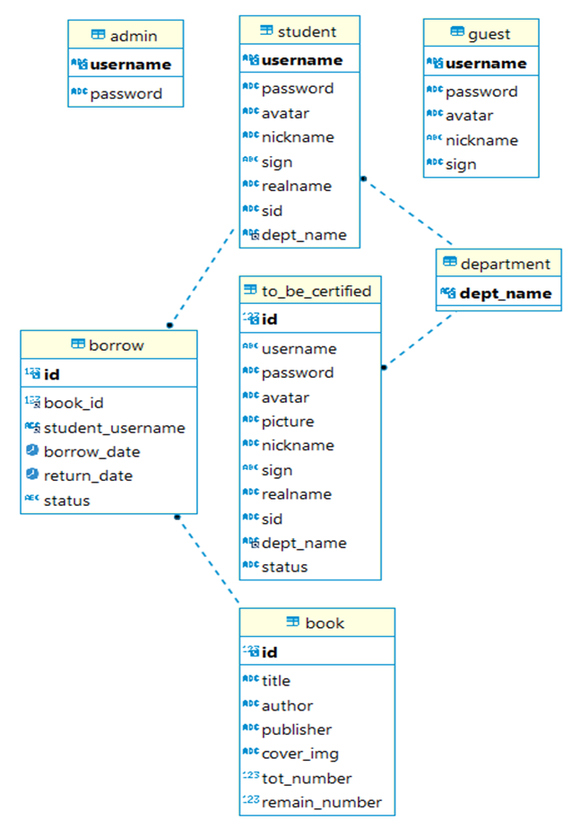

# BookShore
Final project for database.

## 1 功能实现
### 1.1 数据库E-R图

### 1.2 不同权限用户
- admin超管
- student学生
- guest游客
### 1.3 数据库基本功能
- **admin**
获取所有书籍信息【查】
编辑书籍信息【改】
添加一本书【增】
删除一本书【删】
获取所有student和guest用户信息【查】
删除一个student用户/guest用户【删】
获取所有学生认证申请【查】
通过/驳回一条申请【改】
- **student**
注册为学生，提交一条学生认证申请【增】
获取所有书籍信息【查】
借阅一本书，增加一条borrow信息【增】
归还一本书，修改borrow元组中的status 为“已归还” 【改】
获取个人资料【查】
编辑个人资料【改】
- **guest**
注册为游客【增】
获取所有书籍信息【查】
获取个人资料【查】
编辑个人资料【改】
### 1.4 后端/数据库亮点
- token设置
- password哈希加密
- 请求错误处理
### 1.5 页面设计亮点
- 响应式设计
- 分页与筛选
- 走马灯/海报轮播
- 浮动对话框/气泡框
- 拖拽上传， 点击图片显示大图
- 步骤提示表单
... ...
## 2 代码说明
#### 2.1 前后端分离
- axios POST/GET
- Apifox 
#### 2.2 前端
- Vite搭建页面
- React
- Javascript
- Ant design等组件库
#### 2.3 后端
- Node.js
#### 2.4 数据库
- MySQL
